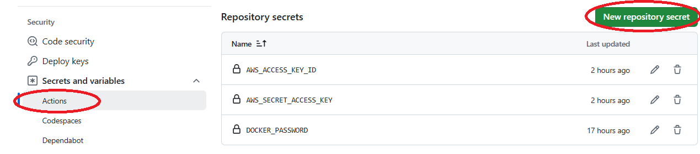
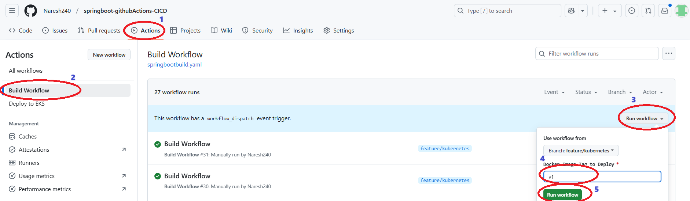

# Springboot Application deploy in EKS using Github Actions CICD

# Pre-Requisites

- EKS Cluster Setup
- ALB Ingress Controller Setup on EKS
- External DNS Setup on EKS

## EKS Cluster Setup

please use this [link](https://github.com/Naresh240/kubernetes/blob/main/eks-cluster-setup/eks-cluster-with-eksctl/README.md) to setup EKS Cluster

## Setup ALB Ingress Controller on EKS

Plese use this [link](https://github.com/Naresh240/kubernetes/blob/main/ALB-Ingress-Controller-Setup/README.md)

## Setup External DNS Setup

Please use this [link](https://github.com/Naresh240/kubernetes/blob/main/External-DNS-Setup/README.md)

## Create Secrets under github
1. Docker Image Tag
2. AWS Access Key
3. AWS Secret Access key

## Create a ACM Certificate

#[ACM Certificate](./images/ACM_Certificate.png)

## Trigger pipeline manually

